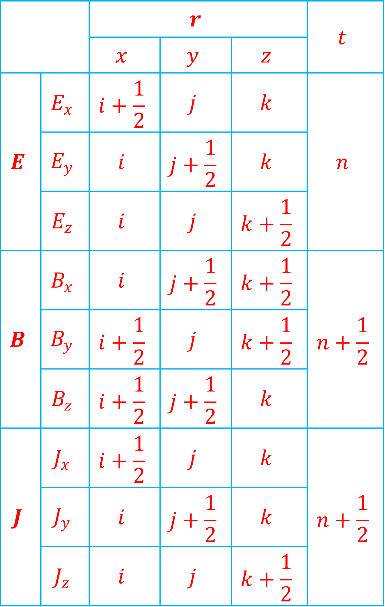

# 一维PIC模拟程序

程序位于`simu_PIC_1D.m`文件中

## 一、基本方程

### 1、电磁场

真空中的麦克斯韦方程组为：

$$
\left \{
\begin{aligned}
& \nabla \times \vec{E} = - \frac{\partial \vec{B}}{\partial t}   \\
& \nabla \times \vec{B} = \mu_0 \vec{J} + \epsilon_0 \mu_0 \frac{\partial \vec{E}}{\partial t}   \\
& \nabla \cdot \vec{E} = \frac{\rho}{\epsilon_0}   \\
& \nabla \cdot \vec{B} = 0   \\
\end{aligned}
\right.
\tag{1}
$$

笛卡尔坐标系中，在一维情况下，假设空间沿$x$方向，那么沿$y$和$z$方向的偏导数为零，方程组(1)中的第一式化为：

$$
\left \{
\begin{aligned}
& \frac{\partial B_x}{\partial t} = 0     \\
& \frac{\partial B_y}{\partial t} = \frac{\partial E_z}{\partial x}   \\
& \frac{\partial B_z}{\partial t} = - 
\frac{\partial E_y}{\partial x}
\end{aligned}
\right.
\tag{2}
$$

$B_x$不随时间变化。方程组(1)中第二式化为：

$$
\left \{
\begin{aligned}
& \frac{\partial E_x}{\partial t} = - \frac{1}{\epsilon_0} J_x    \\
& \frac{\partial E_y}{\partial t} = - c^2 \frac{\partial B_z}{\partial x} - \frac{1}{\epsilon_0} J_y    \\
& \frac{\partial E_z}{\partial t} = c^2 \frac{\partial B_y}{\partial x} - \frac{1}{\epsilon_0} J_z    \\
\end{aligned}
\right.
\tag{3}
$$

方程组(1)中第三式化为：

$$
\frac{\partial E_x}{\partial x} = \frac{\rho}{\epsilon_0}   \tag{4}
$$

方程组(1)中第四式化为：

$$
\frac{\partial B_x}{\partial x} = 0   \tag{5}
$$

使用式(2)和式(3)求解电场和磁场的三个分量，式(4)和式(5)可用于验证。真空介电常数与真空磁导率满足：

$$
\mu_0 \epsilon_0 = \frac{1}{c^2}   \tag{6}
$$

其中$c$为真空中光速。在模拟中，取：

$$
\left \{
\begin{aligned}
& mu_0 = \frac{1}{c^2}   \\
& \epsilon_0 = 1
\end{aligned}
\right.
\tag{7}
$$

### 2、粒子

粒子位置与速度的关系为：

$$
\vec{r} = \int \vec{v} \ dt   \tag{8}
$$

在一维情况下，上式化为：

$$
r_x = \int v_x \ dt   \tag{9}
$$

粒子的相对论运动方程为：

$$
\frac{d(m\vec{v})}{dt} = q(\vec{E} + \vec{v} \times \vec{B})   \tag{10}
$$

其中$m$为观测到的粒子质量：

$$
m = \gamma m_0   \tag{11}
$$

$m_0$为粒子静止质量，$\gamma$为相对论因子：

$$
\gamma = \frac{1}{\sqrt{1 - \frac{v^2}{c^2}}}   \tag{12}
$$

定义$\vec{u} = \gamma \vec{v}$，即：

$$
\vec{u} = \frac{c}{\sqrt{c^2 - v^2}} \vec{v}   \tag{13}
$$

解出$\vec{v}$，可以得到：

$$
\vec{v} = \frac{c}{c^2 + u^2} \vec{u}   \tag{14}
$$

那么方程(10)可以写为：

$$
\frac{d\vec{u}}{dt} = \frac{q}{m_0} \left ( \vec{E} + \frac{c}{\sqrt{c^2 + u^2}}\vec{u} \times \vec{B} \right )   \tag{15}
$$

定义：

$$
\vec{B}_u = \frac{c}{\sqrt{c^2 + u^2}} \vec{B}   \tag{16}
$$

那么式(15)化为：

$$
\frac{d\vec{u}}{dt} = \frac{q}{m_0}(\vec{E} + \vec{u} \times \vec{B}_u)   \tag{17}
$$

### 3、电流

假设粒子的电荷量为1，速度为0.3，电流为$J_x = 0.3$，在一个时间步从$x_0 = 2.9$运动到$x_1 = 3.2$，如下图所示：

粒子运动的线段被$x = 3$分布两段，长度之比为$1:2$，那么两段线段所分配到的电流之比为$1:2$。将电流定义在半整数格点上，则左侧电流被分配到$x = 2.5$，右侧电流被分配到$x = 3.5$处，分别为$0.1$和$0.2$，这样分配后得到的电流密度和电荷密度的分布满足连续性方程。

## 二、格点分配

要求取微分方程的数值解，需要将导数化为差分，这里使用中心差分。在此之前，需要将场定义到格点上，如下表所示：

这里显示的三维情况下的格点分配，一维情况下只需关注$x$方向的格点分配即可。模拟的流程如下所示：

## 三、差分方程

### 1、电磁场

根据以上格点定义，方程组(2)写成差分形式为：

$$
\left \{
\begin{aligned}
& B_y(i + \frac{1}{2}, n + \frac{1}{2}) = B_y(i+\frac{1}{2}, n - \frac{1}{2}) + \frac{\Delta t}{\Delta x} [E_z(i + 1, n) - E_z(i, n)]     \\
& B_z(i + \frac{1}{2}, n + \frac{1}{2}) = B_z(i+\frac{1}{2}, n - \frac{1}{2}) - \frac{\Delta t}{\Delta x} [E_y(i + 1, n) - E_y(i, n)]
\end{aligned}
\right.
\tag{18}
$$

由于粒子速度是定义在整数格点上，而计算粒子速度时，需要整数格点上的磁场，因此，磁场需要推动两次，每次推动$\frac{1}{2}\Delta t$，推动第一次后，完成粒子速度的计算，然后再次推动磁场。方程组(3)化为差分形式：

$$
\left \{
\begin{aligned}
& E_x(i + \frac{1}{2}, n + 1) = E_x(i + \frac{1}{2}, n) - \frac{\Delta t}{\epsilon_0} J_x(i + \frac{1}{2}, n + \frac{1}{2})     \\
& E_y(i, n+1) = E_y(i, n) - c^2\Delta t[B_z(i+\frac{1}{2}, n+\frac{1}{2}) - B_z(i-\frac{1}{2}, n+\frac{1}{2})] - \frac{\Delta t}{\epsilon_0} J_y(i, n + \frac{1}{2})   \\
& E_z(i, n+1) = E_z(i, n) + c^2\Delta t[B_y(i+\frac{1}{2}, n+\frac{1}{2}) - B_y(i-\frac{1}{2}, n+\frac{1}{2})] - \frac{\Delta t}{\epsilon_0} J_z(i, n + \frac{1}{2})
\end{aligned}
\right.
\tag{19}
$$

### 2、粒子

位置定义在整数时间步上，速度定义在半整数时间步上，那么式(9)可以写为：

$$
r_x(n + 1) = r_x(n) + \Delta t \ v_x(n + \frac{1}{2})   \tag{20}
$$

式(17)可以写为：

$$
\frac{\vec{u}(n+\frac{1}{2}) - \vec{u}(n - \frac{1}{2})}{\Delta t} = \frac{q}{m_0} \left [ \vec{E}(n) + \frac{\vec{u}(n + \frac{1}{2}) - \vec{u}(n - \frac{1}{2})}{2} \times \vec{B}_u(n) \right ]   \tag{21}
$$

可以使用Buneman-Boris方法求解上式。第一步：

$$
\vec{u}(n - \frac{1}{2}) = \frac{c}{\sqrt{c^2 - v^2(n - \frac{1}{2})}}\vec{v}(n-\frac{1}{2})   \tag{22}
$$

第二步：

$$
\vec{u}_1(n) = \vec{u}(n - \frac{1}{2}) + \frac{q}{m_0} \frac{\Delta t}{2}\vec{E}(n)   \tag{23}
$$

第三步：

$$
\vec{B}_u(n) = \frac{c}{\sqrt{c^2 + u_1^2(n)}}\vec{B}(n)   \tag{24}
$$

第四步：

$$
\vec{u}_{1'} (n) = \vec{u}_1(n) + \frac{q}{m_0} \frac{\Delta t}{2} \vec{u}_1(n) \times \vec{B}_u(n)   \tag{25}
$$

第五步：

$$
\vec{u}_2(n) = \vec{u}_1(n) + \frac{2}{1 + (\vec{B}_u(n) \frac{q}{m_0}\frac{\Delta t}{2})^2} \vec{u}_{1'}(n) \times \vec{B}_u(n)\frac{q}{m_0}\frac{\Delta t}{2}   \tag{26}
$$

第六步：

$$
\vec{u}(n + \frac{1}{2}) = \vec{u}_2(n) + \frac{q}{m_0} \frac{\Delta t}{2} \vec{E}(n)   \tag{27}
$$

第七步：

$$
\vec{v}(n + \frac{1}{2}) = \frac{c}{\sqrt{c^2 + u^2(n + \frac{1}{2})}} \vec{u}(n + \frac{1}{2})   \tag{28}
$$

最终将速度从$n - \frac{1}{2}$推到$n + \frac{1}{2}$。

## 四、程序说明

使用`matlab`实现，所有程序位于`simu_PIC_1D.m`文件中。

|        函数名         |              功能              |
| -------------------- | ----------------------------- |
| `simu_PIC_1D`        | 程序入口函数                    |
| `input_parameters`   | 根据相应的模型，获取输入参数     |
| `initialization`     | 根据相应的模型初始化            |
| `diagnosis`          | 根据相应的模型，调用绘图程序     |
| `memory_particle_2s` | 为粒子分配内存空间（电子和离子） |
| `memory_field`       | 为场分配内存空间                |
| `advance`            | 推动场和粒子                    |
| `magnetic`           | 推动磁场                       |
| `electric`           | 推动电场                       |
| `position`           | 更新粒子位置                    |
| `velocity`           | 更新粒子速度                    |
| `vector_square`      | 计算矢量模的平方                |
| `vector_mod`         | 计算矢量的模                    |
| `vector_cross`       | 计算矢量的叉乘                  |
| `current`            | 计算电流                       |
| `boundary_copy`      | 处理场的边界                    |
| `boundary_add`       | 处理由粒子产生的场的边界         |
| `boundary_particle`  | 处理粒子边界                    |
| `relativity`         | 热速度的相对论修正              |
| `smooth_field`       | 平滑场                         |
| `select_model`       | 弹出选择模型对话框              |
| `smoothdlg`          | 弹出是选择否平滑场的对话框       |
| `assign2grid`        | 将粒子数据插值到格点上          |
| `gass_law`           | 计算电场的高斯定理              |
| `continuity`         | 计算连续性方程                  |
| `particle_energy`    | 计算粒子能量                    |
| `energy`             | 计算模拟空间中场和粒子的能量     |

