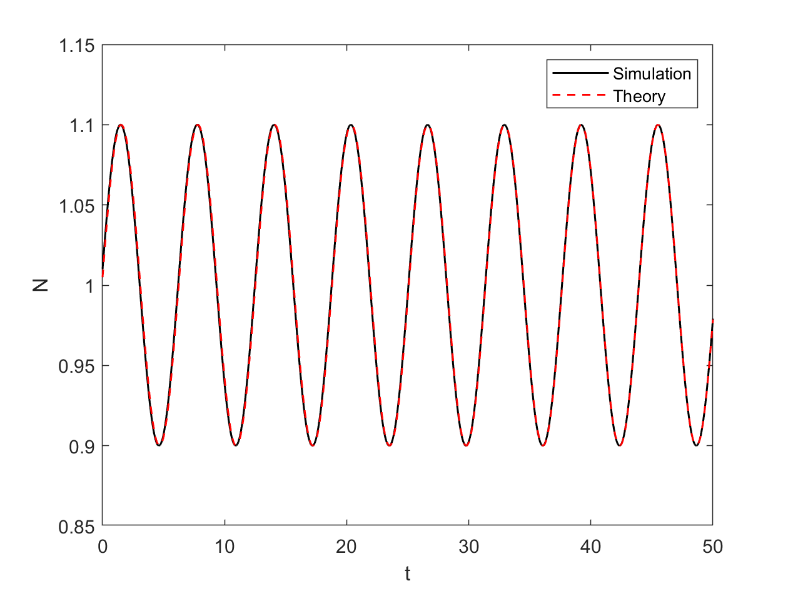

# 朗缪尔振荡

初始时电子离子的速度都为零，一个离子对应一个电子。电子出现一个微小的扰动偏离平衡位置，离子固定不动。由于电子离子出现偏移，这会产生一个电场$\delta E$，将电子拉回平衡位置。最终产生一个振荡，即朗缪尔振荡。整个过程所满足的方程为：

$$
\frac{\partial \delta n}{\partial t} = - n_e \frac{\partial \delta v_{e,x}}{\partial x}   \tag{1}
$$

$$
\frac{\partial \delta v_{e,x}}{\partial t} = - \frac{e}{m_e} \delta E   \tag{2}
$$

$$
\frac{\partial \delta E}{\partial x} = -\frac{e}{\epsilon_0} \delta n   \tag{3}
$$

联立这三个方程可以得到：

$$
\frac{\partial^2\delta n}{\partial t^2} + \frac{e^2n_e}{m_e\epsilon_0}\delta n = 0   \tag{4}
$$

其中$n_e$为初始时的电子密度，$\delta n$为密度扰动，$\delta v_{e,x}$为速度扰动，$\delta E$为电荷分离产生的电场，振荡频率为电子等离子体频率：

$$
\omega_{pe}^2 = \frac{e^2n_e}{m_e\epsilon_0}   \tag{5}
$$

式(4)的解是一个简谐振动，可以直接给出密度扰动随时间的变化。方程(4)的解的形式为：

$$
\delta n = A \cos (\omega_{pe} t + \phi)   \tag{6}
$$

求PIC模拟噪声太大，无法产生显著的Langmuir振荡，直接求解振荡方程。取方程(4)的数值解，将其离散化，得到的差分方程为：

$$
\frac{\delta n(i, n + 1) - 2\delta n(i, n) + \delta n(i, n -1)}{\Delta t^2} = - \omega_{pe}^2 \delta n(i, n)   \tag{7}
$$

其中$i$为空间格点，$n$为时间格点。根据上式，得到的$t = (n + 1)\Delta t$时刻的密度扰动为：

$$
\delta n(i, n+1) = 2\delta n(i, n) - \delta n(i, n- 1) - \omega_{pe}^2 \Delta t^2 \delta n(i, n)   \tag{8}
$$

求解上式的`matlab`程序如下(`simu_Langmuir_Oscillations.m`)：

```matlab
%%
% simulate the Langmuir oscillation
%%
clear;

%% parameters
% number of grids in space
nx = 1000;

% nmber of time step
nt = 1000;


% initial density
n = 1;

% initial density disturbance
dnt0 = 0.1;

% elementary charge
e = 1;

% mass of electron
m = 1;

% vacuum permittivity
epsilon = 1;

% time step and grid length
dx = 0.1;
dt = 0.05;
Lx = dx*nx;
lx = linspace(0, Lx, nx);

%% the electron plasma frequency
wp = sqrt(n*e*e/(m*epsilon));

%% apply for memory
dn0 = zeros(1, nx);     % previous
dn1 = zeros(1, nx);     % current
dn2 = zeros(1, nx);     % next
nn = zeros(1, nt);

%% initial condition
dn1 = dn1 + dnt0 .* sin(dt) .* sech(((1:nx) - nx*0.5)*dx);
nn(1) = dn1(nx/2);
figure;
pause('on');
%% solve the equation
for t = 1:nt
    dn2 = 2*dn1 - dn0 - wp*wp*dt*dt*dn1;

    %% switch data
    dn0 = dn1;
    dn1 = dn2;
    nn(t) = dn2(nx / 2) + n;

    %% figure
    plot(lx, dn2 + n, '-r', 'LineWidth', 2);
    xlim([0, Lx]);
    ylim([n - dnt0 * 1.5, n + dnt0*1.5]);
    xlabel('X');
    ylabel('N');
    title(['t = ', num2str(t*dt, '%06.2f')]);
    pause(0.01);
end

%% 
figure;
tt = nt*dt;
lt = linspace(0, tt, nt);
plot(lt, nn, '-k', 'LineWidth', 1);
hold on
plot(lt, dnt0*sin(wp*(lt + dt)) + n, '--r', 'LineWidth', 1);
legend('Simulation', 'Theory');
xlabel('t');
ylabel('N');
xlim([0, tt]);
ylim([n - dnt0 * 1.5, n + dnt0*1.5]);
```

运行结果如下：



其中黑色实线为模拟得到的结果，红色虚线为根据式(6)得到的理论结果。

