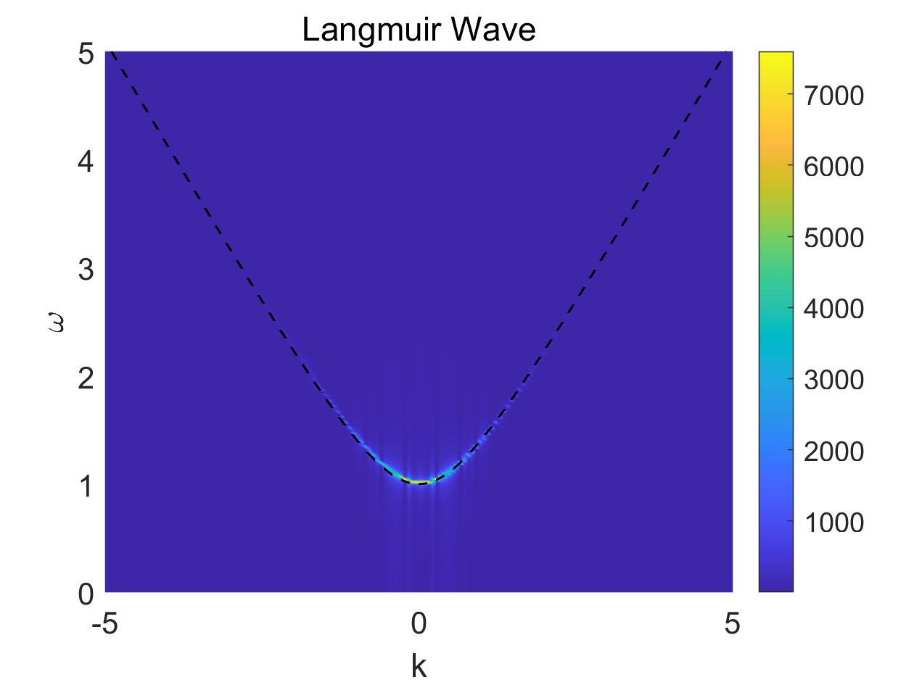

# 朗缪尔波


[朗缪尔振荡](1.Langmuir_oscillation.md)假设了电子静止不动，即电子速度完全为零。实际情况下，电子会有热速度。考虑电子热速度后，朗缪尔振荡开始传播，变成朗缪尔波。


然后假设电子和离子成对存在，设电子密度为$n_e$，密度扰动为$\delta n$，电子速度扰动为$\delta v$，只考虑$x$方向，忽略二阶小量，电子连续性方程可以写为：

$$
\frac{\partial \delta n}{\partial t} = - n_e \frac{\partial \delta v}{\partial x}   \tag{1}
$$

由于电荷分离产生的电场为$\delta E$，它满足电场的高斯定理：

$$
\frac{\partial \delta E}{\partial x} = -\frac{e}{\epsilon_0}\delta n   \tag{2}
$$

假设电子温度恒定为$T_e$，那么电子压强变化可以表示为：

$$
\delta p_e = \gamma_e k_BT_e \delta n   \tag{3}
$$

其中$\gamma_e$为多方指数，$k_B$为玻尔兹曼常数。同样忽略二阶以上的项，并且不存在磁场，电子动量方程可以写为：

$$
\frac{\partial \delta v}{\partial t} + \frac{\gamma_e k_BT_e}{mn_e} \frac{\partial \delta n}{\partial x} + \frac{e}{m} \delta E = 0   \tag{4}
$$

其中$m$为电子质量。方程(4)对$x$求偏导，代入式(1)和式(2)消去$\delta v$和$\delta E$，得到：

$$
\frac{\partial^2 \delta n}{\partial t^2} - \frac{\gamma_ek_BT_e}{m} \frac{\partial^2 \delta n}{\partial x^2} + \omega_{pe}^2 \delta n = 0   \tag{5}
$$

其中$\omega_{pe}$为电子等离子体频率：

$$
\omega_{pe}^2 = \frac{e^2n_e}{m\epsilon_0}   \tag{6}
$$

当波动为平面波时，方程(5)的解的形式为：

$$
\delta n = C \exp(ikx - i\omega t)   \tag{7}
$$

其中$C$为常数，将式(7)代入到式(5)，可以得到朗缪尔波的色散关系：

$$
\omega^2 = \omega_{pe}^2 + k^2 \gamma_e v_{the}^2   \tag{8}
$$

其中$v_{the}$为电子热速度：

$$
v_{the}^2 = \frac{k_BT_e}{m}   \tag{9}
$$

求PIC模拟噪声太大，无法产生显著的Langmuir波，直接求解振荡方程。取方程(5)的数值解，将方程(5)离散，化为差分方程：

$$
\frac{\delta n(i, n+1) - 2\delta n(i, n) + \delta n(i, n - 1)}{\Delta t^2} = \gamma_ev_{the}^2 \frac{\delta n(i+1, n) - 2 \delta n (i, n) + \delta n(i-1, n)}{\Delta x^2} - \omega_{pe}^2 \delta n(i, n) = 0   \tag{10}
$$

上式中，$i$表示空间格点，$n$表示时间格点。令：

$$
\left \{
\begin{aligned}
& K_1 = \gamma_e v_{the}^2 \frac{\Delta t^2}{\Delta x^2}   \\
& K_2 = \omega_{pe}^2 \Delta t^2
\end{aligned}
\right.
\tag{11}
$$

为保证数值稳定性，要求：

$$
K_1 < 1   \tag{12}
$$

那么$t = (n+1)\Delta t$时刻的密度扰动可以写为：

$$
\delta n(i, n+1) = 2\delta(i, n) - \delta n (i, n - 1) + K_1 [\delta n(i+1, n) - 2\delta n (i, n) + \delta n(i - 1, n)] - K_2 \delta n (i, n)   \tag{13}
$$

求解该方程的`matlab`程序如下（`simu_Langmuir_Wave.m`）：

```matlab
%%
% simulate the Langmuir wave
%%
clear;

%% parameters
% number of grids in space
nx = 1000;

% nmber of time step
nt = 5000;

% polytropic index
gamma = 1;

% electron temperature
Te = 1;

% Boltzmann constant
kB = 1;

% electron mass
m = 1;

% vacuum permittivity
epsilon = 1;

% elementary charge
e = 1;

% initial density
n = 1;

% time step and grid length
dx = 0.1;
dt = 0.05;

% initial density disturbance
dnt0 = 0.1;

%% the electron plasma frequency
wp = sqrt(n*e*e/(m*epsilon));

%% some constant values
K = gamma * kB * Te / m;
v = sqrt(K);
vthe = sqrt(kB * Te / m);
C1 = K * dt * dt / (dx * dx);
C2 = dt * dt * wp * wp;

%% apply for memory
xx = nx + 4;
dn0 = zeros(1, xx);     % previous
dn1 = zeros(1, xx);     % current
dn2 = zeros(1, xx);     % next
nn = zeros(nt, nx);

box = 3:nx+2;

%% space and time length
Lx = nx * dx;
lx = linspace(0, Lx, nx);
TT = nt * dt;
lt = linspace(0, TT, nt);

%% the initial condition
dn1 = dn1 + dnt0 .* sin(dt) .* sech(((1:xx) - xx*0.5)*dx);

%% solve the wave equation
figure;
pause('on');
for t = 1:nt
    dn2(box) = 2 * dn1(box) - dn0(box) + C1 * (dn1(box + 1) - 2 * dn1(box) + dn1(box - 1)) - C2 * dn1(box);

    %% boundary condition
    dn2 = boundary(dn2, 'periodic', box, dx, dt, v, dn1);

    %% save the data
    dn0 = dn1;
    dn1 = dn2;
    nn(t, :) = dn2(box);

    plot(lx, dn1(box) + n, '-r', 'LineWidth', 1);
    title(['t = ', num2str(t*dt, '%06.2f')]);
    ylabel('N');
    xlim([0,Lx]);
    ylim([n-dnt0, n+dnt0]);
    xlabel('X');
    pause(0.001);
end


figure;
F = fftshift(fft2(nn));
k = 2*pi/dx;
k = linspace(-k*0.5, k*0.5, nx);
f = 2*pi/dt;
f = linspace(-f*0.5, f*0.5, nt);


[X, Y] = meshgrid(k, f);
p = pcolor(X, Y, abs(F));
shading flat;
p.FaceColor = 'interp';
colorbar;

w = sqrt(wp*wp + k.*k.*gamma.*vthe.*vthe);
hold on
plot(k, w, '--k', 'LineWidth', 1);

xlim([-5,5]);
ylim([0,5]);

xlabel('k');
ylabel('\omega');
title('Langmuir Wave');
set(gca,'FontSize', 14);


%% boundary
function fd = boundary(fd, type, box, dx, dt, v, fd0)
if strcmp(type, 'periodic')
    fd(box(1) - 1) = fd(box(end));
    fd(box(end) + 1) = fd(box(1));
elseif strcmp(type, 'open')
    k = dx/(v*dt);
    fd(box(end) + 1) = fd(box(end)) - k * (fd(box(end)) - fd0(box(end)));
    fd(box(1) - 1) = fd(box(1)) - k * (fd(box(1)) - fd0(box(1)));
elseif strcmp(type, 'dirichlet')
    fd(box(end) + 1) = 0;
    fd(box(1) - 1) = 0;
elseif strcmp(type, 'neumann')
    fd(box(end) + 1) = fd(box(end));
    fd(box(1) - 1) = fd(box(1));
end
end
```

程序执行结果如下：



其中黑色虚线为根据式(8)得到的色散关系的理论值。
